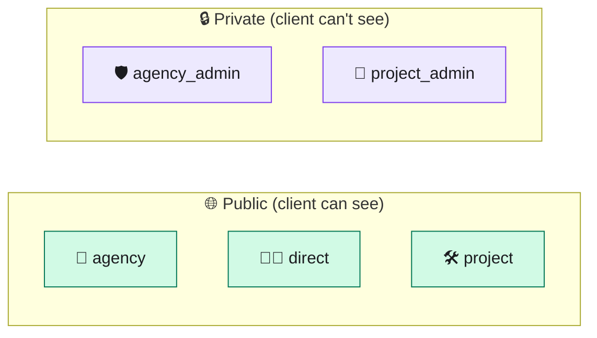
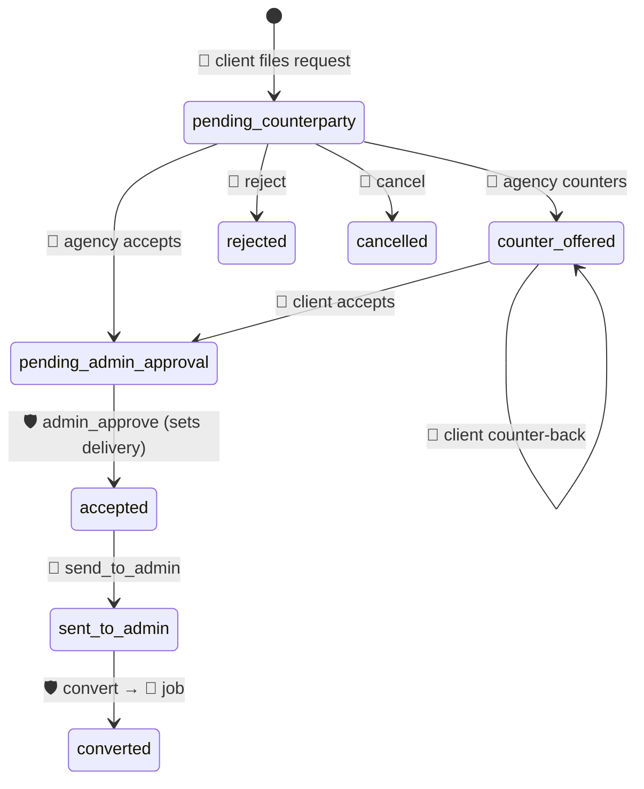
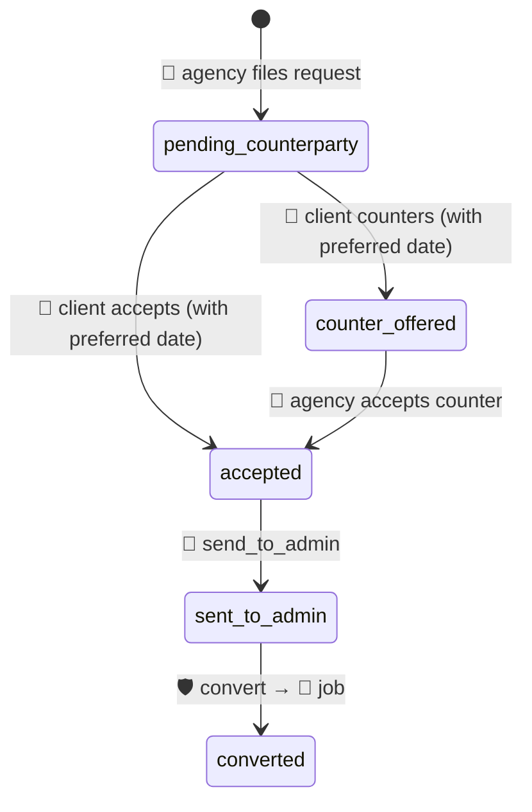
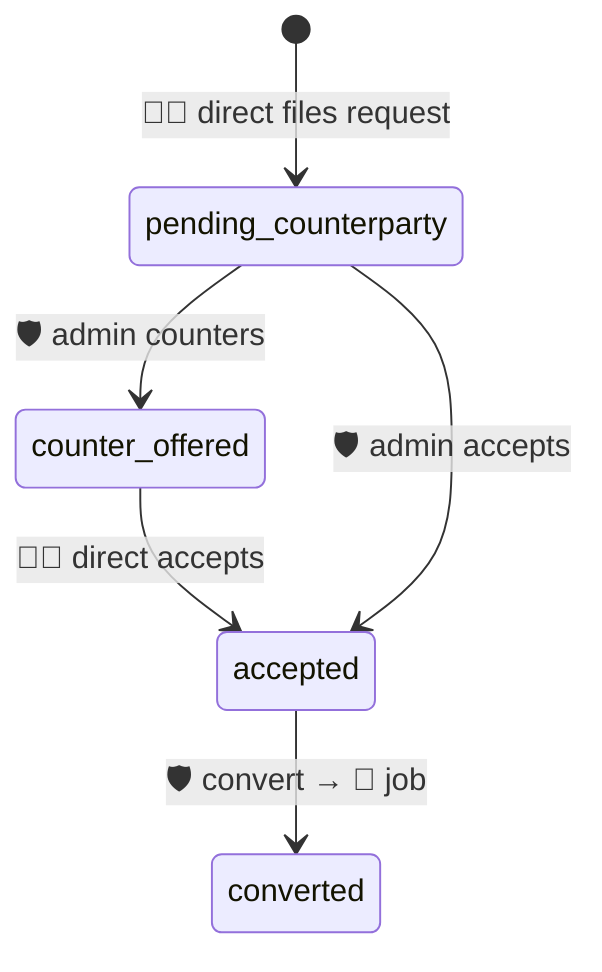
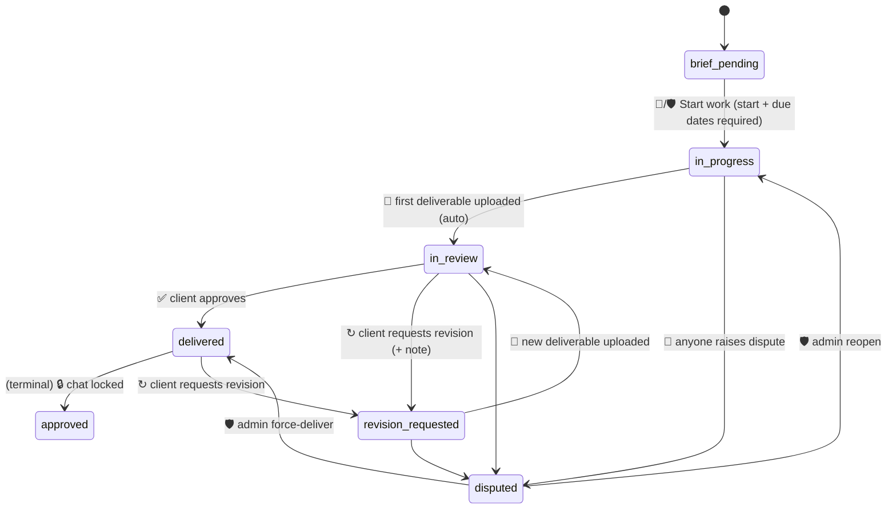
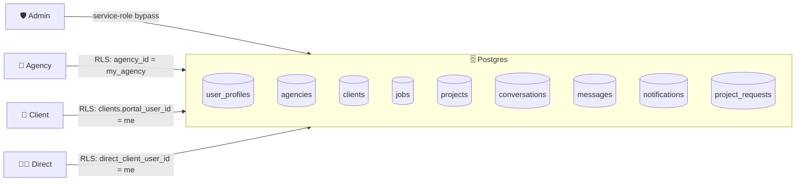

# 🗺️ nexxtt.io · Portal Map

> How the four portals connect, who can do what, and where every chat, request
> and status transition lives. This is a ground-truth reference — it reflects
> the code, not a design intent.

---

## 🎨 Legend

| Portal | Role | Route | Color |
|:---:|:---|:---|:---|
| 🛡 | **Super Admin** | `/admin/*` | 🟣 purple |
| 🏢 | **Agency (partner)** | `/agency/*` | 🟢 teal |
| 👤 | **Agency Client** (white-label) | `/portal/<agency-slug>/<client-slug>/*` | 🟡 amber |
| 🧑‍💼 | **Direct Client** | `/direct/*` | 🟢 green |

---

## 🧭 The Big Picture

```mermaid
flowchart TB
  subgraph PLATFORM["🌐 nexxtt.io"]
    ADMIN["🛡<br/>Super Admin<br/><code>/admin</code>"]
  end

  subgraph RESELLER["🏢 Agency Partner A"]
    AGENCY["Agency<br/><code>/agency</code>"]
    CLIENT1["👤 Client 1<br/><code>/portal/a/c1</code>"]
    CLIENT2["👤 Client 2<br/><code>/portal/a/c2</code>"]
  end

  DIRECT["🧑‍💼 Direct Client<br/><code>/direct</code>"]

  %% Chat / work connections
  ADMIN  -- "💬 agency_admin (global)" --- AGENCY
  ADMIN  -- "💬 project_admin (per-order)" -.-> AGENCY
  ADMIN  -- "💬 direct (global)" --- DIRECT

  AGENCY -- "💬 agency (per-client)" --- CLIENT1
  AGENCY -- "💬 agency (per-client)" --- CLIENT2

  AGENCY -- "💬 project (per-order, with client)" --- CLIENT1
  AGENCY -- "💬 project (per-order, with client)" --- CLIENT2
  ADMIN  -. "👁 observer" .-> CLIENT1
  ADMIN  -. "👁 observer" .-> CLIENT2

  ADMIN  -- "💬 project (direct)" --- DIRECT

  classDef admin  fill:#ede9fe,stroke:#7c3aed,color:#1b1b1f
  classDef agency fill:#ccfbf1,stroke:#0f766e,color:#1b1b1f
  classDef client fill:#fef3c7,stroke:#b45309,color:#1b1b1f
  classDef direct fill:#d1fae5,stroke:#047857,color:#1b1b1f

  class ADMIN admin
  class AGENCY agency
  class CLIENT1,CLIENT2 client
  class DIRECT direct
```

- Solid lines = always-on channels.
- Dotted lines = observer access (read-only or scoped).

---

## 🧑‍🤝‍🧑 Who Each Role Is

### 🛡 Super Admin
The platform operator at nexxtt.io. Sees *everything* across every agency and
every direct client. Converts requests into jobs, picks initial status, sets
delivery dates on client-initiated work, uploads deliverables, resolves
disputes, and invites agencies.

### 🏢 Agency Partner
A reseller running a white-labeled design-services business on top of
nexxtt.io. Works against their own cost price, charges clients their own
retail price, pockets the difference. Coordinates with admin privately per
order, with their clients publicly per order, and invites clients into a
white-label portal branded with the agency's colors and logo.

### 👤 Agency Client
The agency's end customer. Logs into the agency-branded portal at
`/portal/<agency>/<client>`. Never sees cost or margin, only the retail price
the agency quoted them. Files project requests, approves deliverables, asks
for revisions.

### 🧑‍💼 Direct Client
An end user who came straight to nexxtt.io with no agency in between. Same
capabilities as an agency client, but their counter-party is admin, not an
agency.

---

## ✅❌ Permission Matrix

| Capability                                     | 🛡 Admin | 🏢 Agency | 👤 Client | 🧑‍💼 Direct |
|:-----------------------------------------------|:-------:|:--------:|:--------:|:---------:|
| See every order across the platform            |   ✅    |    ❌    |    ❌    |    ❌     |
| See own-tenant orders                          |   ✅    |    ✅    |    ✅    |    ✅     |
| See cost price + profit                        |   ✅    |    ✅    |    ❌    |    ❌     |
| See retail price                               |   ✅    |    ✅    |    ✅    |    ✅     |
| Create project request                         |   ✅    |    ✅    |    ✅    |    ✅     |
| Accept / reject counter-party offer            |   🟡¹  |    ✅    |    ✅    |    ✅     |
| Approve client-initiated request               |   ✅    |    ❌    |    ❌    |    ❌     |
| Convert request → job                          |   ✅    |    ❌    |    ❌    |    ❌     |
| Pick initial job status                        |   ✅    |    ❌    |    ❌    |    ❌     |
| Start work (set start + due date)              |   ✅    |    ✅    |    ❌    |    ❌     |
| Upload deliverables                            |   ✅    |    ✅    |    ❌    |    ❌     |
| Approve deliverables                           |   ❌    |    ❌    |    ✅    |    ✅     |
| Request revision                               |   ❌    |    ❌    |    ✅    |    ✅     |
| Raise dispute                                  |   ✅    |    ✅    |    ✅    |    ✅     |
| Resolve dispute                                |   ✅    |    ❌    |    ❌    |    ❌     |
| Chat: 1-on-1 with admin (private)              |   —     |    ✅    |    ❌    |    ✅     |
| Chat: agency ↔ admin per order (private)       |   ✅    |    ✅    |    ❌    |    ❌     |
| Chat: project discussion (public)              |   👁²   |    ✅    |    ✅    |    ✅     |
| Chat: agency ↔ client per client               |   ❌    |    ✅    |    ✅    |    ❌     |
| Invite users                                   |   ✅ agencies | ✅ clients | ❌ | ❌ |
| Set retail price on a service                  |   —     |    ✅    |    ❌    |    ❌     |
| Resolve with force-deliver                     |   ✅    |    ❌    |    ❌    |    ❌     |

¹ Admin doesn't negotiate offers — they approve them.
² Admin observes the project chat read-only (replies happen in the per-order private thread instead).

---

## 💬 Chat Channel Reference

Conversations are scoped by a `tier` column. Five tiers exist in production.

| Tier              | Between                             | Scope       | Visible to client? | Route in UI |
|:------------------|:------------------------------------|:------------|:-------------------|:------------|
| 🏢 `agency`        | Agency ↔ Agency Client             | Per client  | ✅                 | Agency: `/agency/requests?client=…` · Client: `/portal/<a>/<c>/requests` |
| 🧑‍💼 `direct`      | Admin ↔ Direct Client              | Per user    | ✅ (client = direct) | Admin: `/admin/requests` · Direct: `/direct/requests` |
| 🛠 `project`      | Agency + Client (or Direct) + 👁Admin | Per project | ✅                 | `/<portal>/projects/<id>?tab=chat` |
| 🛡 `agency_admin`  | Admin ↔ Agency                     | Per agency  | ❌                 | Admin: `/admin/requests` · Agency: `/agency/requests?thread=admin` |
| 🔐 `project_admin` | Admin ↔ Agency                     | Per project | ❌                 | `/<admin\|agency>/projects/<id>?tab=chat&thread=admin` |



---

## 🔄 Request → Job Lifecycle

### Client-initiated (Agency tier)



### Agency-initiated (Agency tier)



### Direct-initiated



---

## 🏗️ Job / Project Lifecycle

Once converted, the order becomes a **job** with one or more **projects** (one
per service). Each project has its own status:



> The **Stages** widget (Brief → Wireframes → Visual design → Client review →
> Revisions → Delivered) is a service-specific UI mapping layered on top of
> these statuses. It's visual only; the source of truth is `projects.status`.

---

## 🚫 What They Can't Do (common misconceptions)

| Role | Can't do | Why |
|:---|:---|:---|
| 🛡 Admin | Reply in the project discussion tab | Intentional — admin observes the client-facing thread. Use `project_admin` private thread for agency coordination. |
| 🏢 Agency | See another agency's orders/clients | Tenant isolation (`agency_id` filter + RLS) |
| 🏢 Agency | Convert a request to a job | Only admin converts. Agency forwards via `send_to_admin`. |
| 🏢 Agency | See admin's notes or internal cost fields on another agency's work | Cost columns REVOKE'd at DB level; RLS scopes rows. |
| 👤 Client | See cost or profit | Cost columns REVOKE'd from the anon/authenticated API; retail only in selects. |
| 👤 Client | File a new order into *another* agency's portal | `client_id` scoped; each client row pins to one agency. |
| 👤 Client | Read the private agency↔admin threads | RLS policy `conv_project_admin_agency_view` excludes them; layout guard + scope check on messages API. |
| 🧑‍💼 Direct | Route work through an agency | Direct jobs have `agency_id = null`; UI never presents agency options. |

---

## 📣 Notifications

Each portal has its own bell. The `notifications.link` column is built
**per-recipient** by [lib/notification-links.js](lib/notification-links.js) —
the same event may write different URLs for different recipients so each lands
on their own portal:

| Event | 🛡 Admin gets | 🏢 Agency gets | 👤 Client gets | 🧑‍💼 Direct gets |
|:---|:---|:---|:---|:---|
| New request | `/admin/requests` | `/agency/requests` | `/portal/…/requests` | `/direct/requests` |
| Request converted | `/admin/orders` | `/agency/orders/<id>` → project | `/portal/…` | `/direct/orders/<id>` |
| Project chat message | `/admin/projects/<id>?tab=chat` | `/agency/projects/<id>?tab=chat` | `/portal/…/projects/<id>?tab=chat` | `/direct/projects/<id>?tab=chat` |
| Private agency↔admin per-order | `/admin/projects/<id>?tab=chat&thread=admin` | `/agency/projects/<id>?tab=chat&thread=admin` | — | — |
| Revision requested | `/admin/projects/<id>?tab=chat` (observer) | `/agency/projects/<id>?tab=chat` | — | — |

---

## 🧱 Data / RLS Boundaries (mental model)



- Admin API routes use the **service-role** key and bypass RLS. They still
  self-enforce role checks (`profile.role === 'admin'`).
- Every other portal uses the **user session** — RLS is the real gate.
- Cost columns (`cost_price_cents`, `total_cost_cents`) are column-REVOKED
  from `anon` + `authenticated`; they simply don't come back in selects for
  non-admin sessions.

---

## 🧩 Quick "where do I live" cheat sheet

| If you are… | Your home is… | Your notifications land at… |
|:---|:---|:---|
| 🛡 Admin | [/admin](/admin) | [/admin/requests](/admin/requests), [/admin/orders](/admin/orders) |
| 🏢 Agency | [/agency/dashboard](/agency/dashboard) | [/agency/requests](/agency/requests), [/agency/orders](/agency/orders) |
| 👤 Agency Client | `/portal/<agency>/<client>` | `/portal/<agency>/<client>/requests` |
| 🧑‍💼 Direct Client | [/direct/dashboard](/direct/dashboard) | [/direct/requests](/direct/requests), [/direct/orders](/direct/orders) |

---

_Last refreshed from code on 2026-04-24. If this and the code diverge, **the
code wins** — this file is a generated-by-hand snapshot._
